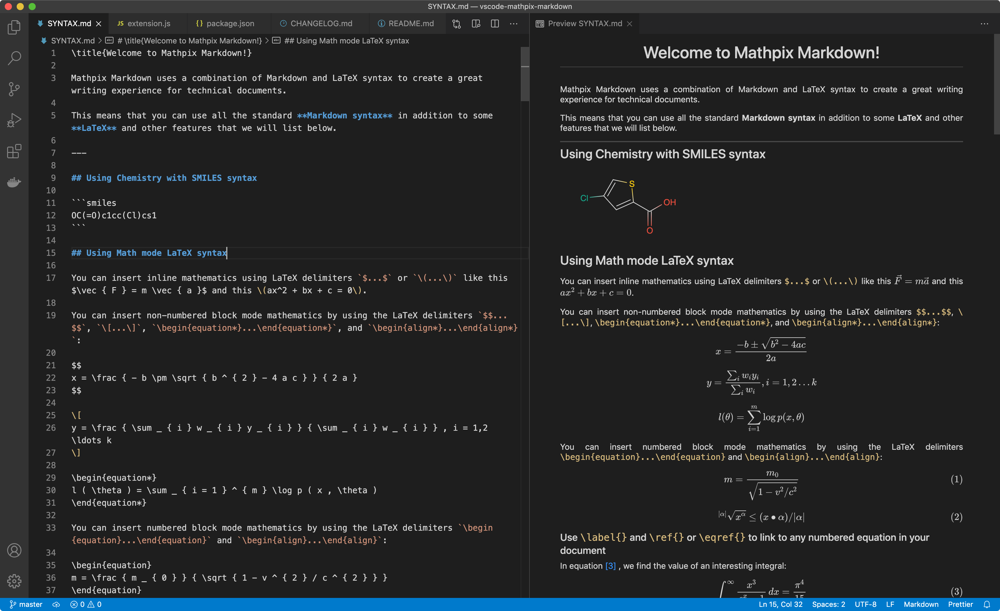

# VSCode Mathpix Markdown Extension



## Features 

- Enables enhanced markdown syntax to be rendered in markdown previews
- Enables a subset of LaTeX commands to be rendered in markdown previews
- Enables SMILES chemistry syntax to be rendered in markdown previews


## Extension Installation

The extension can be installed in several ways:

### From extensions search (`ctrl-shift-x` or `cmd-shift-x`):

Enter `@id:mathpix.vscode-mathpix-markdown`

### From quick open (`ctrl-p` or `cmd-p`):

`ext install @id:mathpix.vscode-mathpix-markdown`

### From CLI:

`code --install-extension mathpix.vscode-mathpix-markdown`

## Mathpix Markdown Usage

Once installed the extension adds supports for all the features of mathpix-markdown such as latex, chemistry and html rendering in the built-in VSCode markdown preview.

To use it open a markdown or mathpix markdown file (with `.md` or `.mmd` extensions) then open the command pallete (`f1` key) and select `Markdown: Open Preview` or `Markdown: Open Preview to the Side`.

Further Documentation:

- [Overview](https://mathpix.com/docs/mathpix-markdown/overview)
- [Syntax Reference](https://mathpix.com/docs/mathpix-markdown/syntax-reference)

## Local Development

You can develop, build and install the extension locally.

```
git clone git@github.com:Mathpix/vscode-mathpix-markdown.git
cd vscode-mathpix-markdown
npm install
vsce package
```

Then in VSCODE:

```
type f1
extensions: Install from VSIX
choose the file vscode-mathpix-markdown-0.0.1.vsix
click reload
open SYNTAX.md
type f1
Markdown: Open Preview to the Side
```
